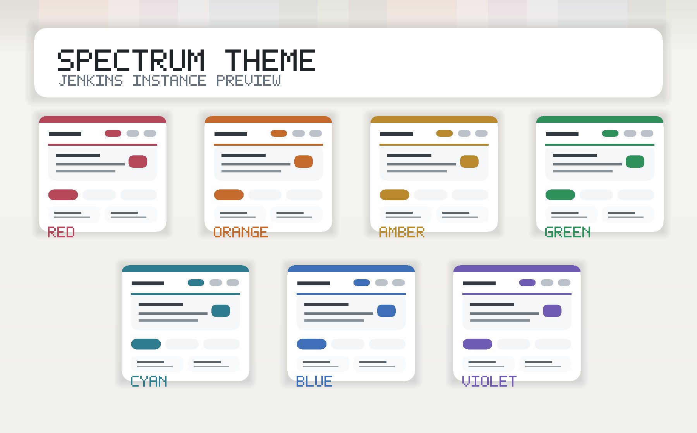

# Spectrum Theme Plugin

[](https://plugins.jenkins.io/spectrum-theme/)
[](https://github.com/jenkinsci/spectrum-theme-plugin/actions/workflows/jenkins-security-scan.yml)
[](LICENSE.md)

Spectrum Theme 提供 7 种灵感来自彩虹色的 Jenkins 主题。
配色做了适度柔化与平衡，便于在日常使用中识别不同实例。



## 主题变体

- `Spectrum Red`
- `Spectrum Orange`
- `Spectrum Amber`
- `Spectrum Green`
- `Spectrum Cyan`
- `Spectrum Blue`
- `Spectrum Violet`

## 使用方式

安装插件后，进入 `Manage Jenkins > Appearance > Themes`，选择一个 `Spectrum` 主题即可。

也支持 Configuration as Code：

```yaml
appearance:
  themeManager:
    disableUserThemes: true
    theme: "spectrumBlue"
```

可用的 JCasC symbol 如下：

- `spectrumRed`
- `spectrumOrange`
- `spectrumAmber`
- `spectrumGreen`
- `spectrumCyan`
- `spectrumBlue`
- `spectrumViolet`

## 设计说明

- 使用共享 CSS 资源，让 Jenkins 在外观设置页切换不同 Spectrum 主题时可以即时生效。
- 保持 Jenkins 默认浅色主题的整体结构，只将颜色主要用于实例识别相关的高信号区域，例如顶部细线、当前导航项、链接 hover、焦点态和菜单 hover。
- 主操作按钮保持 Jenkins 标准蓝色，避免像红色这样的主题色被误解为报错或危险状态。
- 目标是在不做大幅视觉重设计的前提下，提升多实例场景下的辨识度。

## 开发

运行测试：

```bash
mvn test
```

贡献说明请参考 [contribution guidelines](https://github.com/jenkinsci/.github/blob/master/CONTRIBUTING.md)。

本项目基于 MIT License 开源，详见 [LICENSE](LICENSE.md)。
